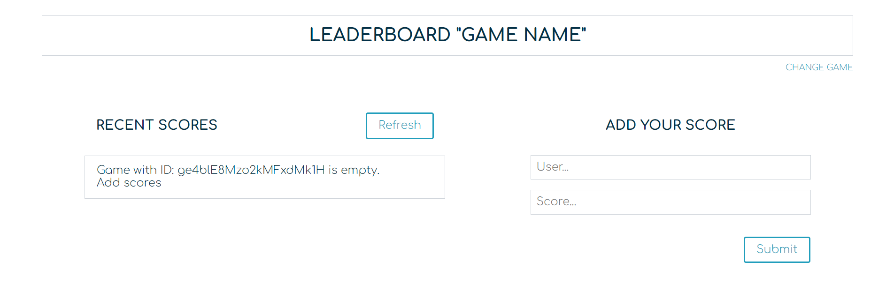
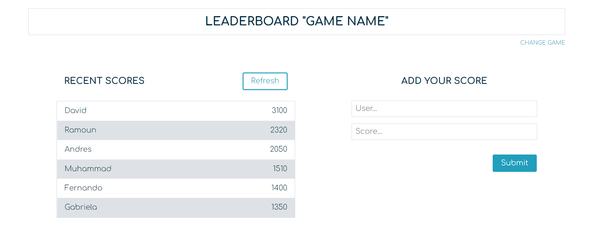

# leaderboard
The leaderboard website displays scores submitted by different players. It also allows you to submit your score. All data is preserved thanks to the external Leaderboard API service.

## Features

- The website displays a basic layout that *dynamically loads* the current score list for the selected game.
- The *game interface* is displayed when the page is loaded and by clicking on the link *change game* below the title of the page.
- A *new game* can be created and an existing game can also be selected using the *game interface*. Game information is saved to local storage.
- *New scores* can be added using the form *add scores* by clicking on its *Submit* button.
- The *added score* can be visualized by updating the *recent scores* list. Update it by clicking on the *refresh* button.

## Built With

- HTML / SCSS / Javascript / Webpack

## Live Demo

[Leaderboard](https://gabyse1.github.io/leaderboard/dist/)

## Getting Started

To get a local copy up and running follow these simple example steps.

### Prerequisites

- Have git installed on your local computer.

### Install

- Clone this repository to your local computer. Choose the location you prefer.
- Run the command *npm install* to install all project's dependencies.

### Deployment

- Run the command line *npm run start*.
- The project will automatically open the *index.html* file in a browser.

## Authors

👤 **Gabriela Sánchez Espirilla**

- GitHub: [@gabyse1](https://github.com/gabyse1)
- Twitter: [@gabyse0](https://twitter.com/gabyse0)
- LinkedIn: [Gabriela](https://www.linkedin.com/in/gabriela-s%C3%A1nchez-espirilla-83011b225/)

## 🤝 Contributing

Contributions, issues, and feature requests are welcome!

Feel free to check the [issues page](../../issues/).

## Show your support

Give a ⭐️ if you like this project!

## Acknowledgments

- Linters: [Microverse](https://github.com/microverseinc/linters-config)
- Readme template: [Microverse](https://github.com/microverseinc/readme-template)

## 📝 License

This project is [MIT](./MIT.md) licensed.